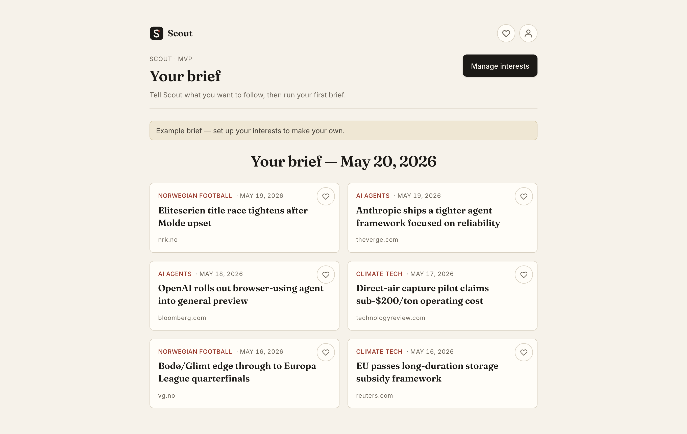

# Scout

A personal news brief that researches on your own machine. You list what you follow;
Scout runs one research session per interest through your own Claude Code CLI and
gives you a short, dated brief with a source on every story. There is no server and no
API key.



**Live UI:** <https://hakon1233.github.io/scout/> (it needs the companion below to
show your own brief).

## Try it in two minutes, offline

You need Node 22 and pnpm 11 (`corepack enable` picks up the pinned version).

```bash
pnpm install
pnpm demo
```

The first run builds the companion, which takes a minute or two. Then open
<http://127.0.0.1:47899/app/>. This runs the real companion with a stub in place of
`claude`, in a throwaway home directory, so it needs no account and makes no network
calls. Add interests, run a brief, open stories, and ask the chat to change your
interests.

## Run it for real

Install and sign in to [Claude Code](https://docs.anthropic.com/en/docs/claude-code),
then:

```bash
pnpm build:agent                       # builds the companion with the web app inside
node packages/agent/dist/cli.js pair   # creates a local pairing token
node packages/agent/dist/cli.js run    # serves Scout on http://127.0.0.1:47821
```

Open <http://127.0.0.1:47821/app/>. The page and the companion share one origin, so the
browser picks up the pairing token by itself; nothing to paste. Your interests, briefs and chat live in
`~/.config/scout/`. On macOS, `node packages/agent/dist/cli.js install-service` keeps
the companion running so the daily brief fires after a reboot.

## How it works

```
browser ──HTTP + pairing token──▶ companion on 127.0.0.1 ──▶ your claude CLI
                                  (packages/agent)              WebSearch, WebFetch
```

- **The web app** (`src/`) is a static Next.js export. It is served from GitHub Pages or
  from the companion itself, and it talks only to the companion.
- **The companion** (`packages/agent/`) is a small Node server with no runtime
  dependencies. It stores your interests and briefs. For each run it starts a `claude`
  session per interest, with web search and fetch only. It then assembles a brief,
  drops stale stories and records which topics came back empty.
- **The chat** edits your interests and the short "intent doc" each one carries. The
  model only proposes changes as JSON. The companion checks them, and holds deletes
  and full rewrites until you confirm.

The trust boundary is the loopback port. The companion checks the Host header and the
origin, needs a pairing token on every data route, and starts `claude` with a fixed tool
list. See [SECURITY.md](SECURITY.md).

More detail: [docs/ARCHITECTURE.md](docs/ARCHITECTURE.md) (code map and invariants) and
[docs/adr/](docs/adr/) (three decisions worth recording). Domain terms are defined in
[CONTEXT.md](CONTEXT.md).

## Tech choices

| Choice                                                     | Why                                                                                                                                                      |
| ---------------------------------------------------------- | -------------------------------------------------------------------------------------------------------------------------------------------------------- |
| The reader's own `claude` CLI, not an API key              | No inference bill and no key custody; articles and interests never reach a server we run ([ADR 0001](docs/adr/0001-inference-on-the-readers-machine.md)) |
| Next.js static export                                      | One build serves GitHub Pages and the companion's own origin ([ADR 0002](docs/adr/0002-one-static-export-two-origins.md))                                |
| `node:http` and zero runtime dependencies in the companion | It runs on the reader's machine with their CLI's sign-in; less code to trust                                                                             |
| JSON and markdown files under `~/.config/scout`            | One reader, one machine; the files stay readable and easy to delete. Writes are atomic and go through one queue                                          |
| `node:test` + Playwright, with a stub `claude`             | Every test runs offline with no model quota                                                                                                              |

## Checks

```bash
pnpm check       # format, typecheck, lint, unit + contract tests, build
pnpm test:e2e    # Playwright against a companion built from source (stub claude)
pnpm eval        # score recorded model outputs against the prompts' rules
```

Checks run locally; there is no hosted CI. `pnpm test` runs about 330 unit and HTTP
contract tests; the e2e suite has 79 specs.

## Status

A personal project, in use by its author. Built and tested on macOS (the launchd
service is macOS-only; the rest is plain Node). The companion is released with
`scripts/release-agent.mjs` as immutable, commit-named builds
([ADR 0003](docs/adr/0003-immutable-companion-releases.md)).

## How this was built

Scout was built by one developer working with AI coding agents (Claude Code). The
developer chose the architecture: no server, research on the reader's machine,
loopback trust. They also made the product decisions, and they reviewed and used
the product. Agents wrote most of the code and tests against those decisions.
The preparation for publication was also agent-driven: security review, module
restructuring, test cleanup and these docs, each change approved by the developer.

## Licence

MIT — see [LICENSE](LICENSE).
